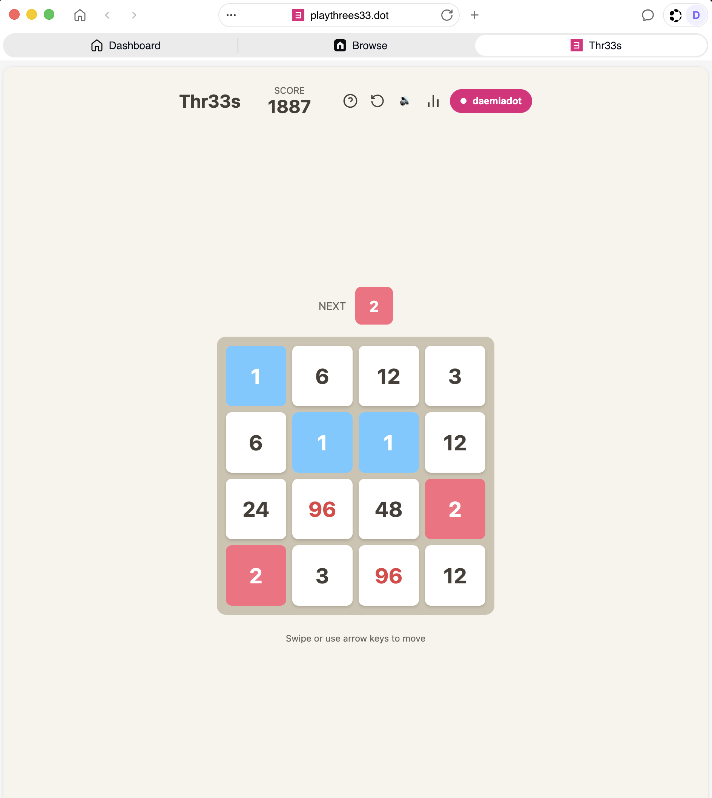

# Thr33s

Web3 Threes — a tile-sliding game where you merge `1 + 2 = 3`, then `3 + 3 = 6`,
`6 + 6 = 12`, … and anchor your high score on an **on-chain leaderboard**.

Thr33s is **Proof-of-Personhood only**: it runs inside the Polkadot host
(Polkadot app, Polkadot Desktop, or the web at
[playthrees33.dev-dot.li](https://playthrees33.dev-dot.li)) and uses your host
identity — no browser-extension wallets. Your PoP username is shown in-app and
on the leaderboard.



## How it works

- **Frontend:** TypeScript + Vite, no framework. Game logic in `src/game/`, UI
  in `src/ui/`, web3 in `src/web3/`.
- **Host integration:** [`@parity/product-sdk`](https://github.com/paritytech/product-sdk)
  (`-host`, `-contracts`, `-address`) + [`polkadot-api`](https://github.com/polkadot-api/polkadot-api)
  v2. The signing identity is the host **product account**; contract gas is
  sponsored via a PGAS (`SmartContractAllowance`) allocation — players need no tokens.
- **Leaderboard:** a `pallet-revive` (PolkaVM) Solidity contract
  (`contracts/Thr33sLeaderboard.sol`) on the **devnet** (Paseo) Asset Hub. Reads
  and writes go through the contracts SDK over the substrate WS (no EVM RPC).
- **Hosting:** the built SPA is published to the Bulletin chain + DotNS as a
  Polkadot product manifest under `playthrees33.dot`.

## Develop

```bash
npm install
npm run dev      # local dev server (game works; host features need a host)
npm run build    # tsc + vite build → dist/
```

The wallet/leaderboard features only activate inside a Polkadot host. Locally
you can play the game; to exercise sign-in + score submission, open the
deployed app in the Polkadot app/desktop or at `playthrees33.dev-dot.li`.

## Project layout

| Path | What |
|------|------|
| `src/game/` | Pure game logic (board, tiles, scoring, state) |
| `src/ui/` | DOM rendering, animations, touch, modals |
| `src/web3/` | Host connect (`host-wallet.ts`), PAPI client + contract (`client.ts`), leaderboard (`leaderboard.ts`), chain config (`config.ts`) |
| `contracts/` | `Thr33sLeaderboard.sol` |
| `scripts/deploy.mjs` | Contract deploy (resolc + PAPI over substrate WS) |
| `polkadot-app-deploy.config.ts` | Product manifest (display name, icon, app `appVersion`) |

## Deploy

See **[DEPLOY.md](DEPLOY.md)** — contract deploy, frontend publish, account
mapping, and getting listed in the host directory.

## License

MIT (see `contracts/Thr33sLeaderboard.sol` SPDX header).
